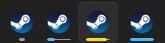

# Taskbar Download progress

A Millennium plugin that displays the Steam download status on the Windows taskbar.

## Features
- Displays the Steam download status on the Windows taskbar
    - This functionality is only supported on Windows

## Prerequisites
- [Millennium](https://steambrew.app/)

## Installation
- Copy the plugin ID from the [Millennium plugins](https://steambrew.app/plugins) page
- Click `Plugins` and `Install a plugin` in the Millennium settings and paste the ID

## Installation - dev build
- Download a dev build from GitHub Releases
- Overwrite the contents of the plugin under the plugins directory (usually `c:\Program Files (x86)\Steam\plugins`)
- Enable the plugin in the Millennium settings if needed
- Allow 10 seconds for the plugin to load after each startup

## Contributors

Huge thanks to Shadow for the crash fix!

Made with [contrib.rocks](https://contrib.rocks).
